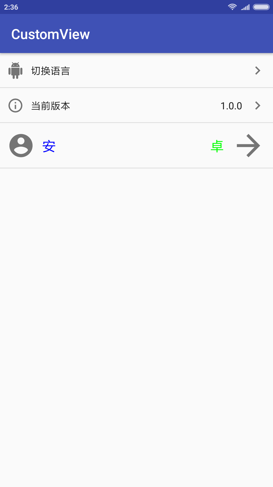

# CustomView
安卓自定义控件库。将项目中常用的自定义控件封装成依赖库，方便直接使用。

# 功能描述
目前，库中有一个设置界面常用的单行选项布局。

### ItemView
设置界面常用的单行选项布局。

# 效果展示
  

# 下载
AndroidStudio，在modle下的build.gradle中添加依赖
```groovy
dependencies {
  compile 'com.andlong.library:customview:1.0.0'
}
```

# 使用
### 1. xml中使用，只是列出了部分属性。
```xml
<com.and2long.customview.ItemView
        android:layout_width="wrap_content"
        android:layout_height="wrap_content"
        app:icon_left="@drawable/ic_android"
        app:text_left="切换语言" />

```
### 2. 代码中使用
```
ItemView itemView = new ItemView(this)
                .setItemHeight(65)                             //控件整体高度
                .setTextLeft("安")                              //左侧文字
                .setTextRight("卓")                             //右侧文字
                .setHintTextRight("hint")                       //右侧隐藏文字
                .setTextSizeLeft(20)                            //左侧文字大小
                .setTextSizeRight(20)                           //右测文字大小
                .setTextColorLeft(Color.BLUE)                   //左侧文字颜色
                .setTextColorRight(Color.GREEN)                 //右侧文字颜色
                .setIconLeft(R.drawable.ic_account_circle)      //左侧图标
                .setIconRight(R.drawable.ic_arrow_forward)      //右侧图标
                .showIconLeft(true)                             //显示左侧图标
                .showIconRight(true)                            //显示右侧图标
                .setIconSizeLeft(40)                            //左侧图标大小
                .setIconSizeRight(50)                           //右侧图标大小
                .showDividerTop(false)                           //显示顶部分割线
                .showDividerBottom(true);                       //显示顶部分割线
```

# 属性说明

属性名 | 字段 | 描述 | 默认值
----|------|----| ----
item_height | dimension | 整体控件高度 | 默认50dp
text_left | string  | 左边文字字符串 | 默认空
text_right | string  | 左上文字字符串 | 默认空
text_hint | string  | 右侧隐藏文字 | 默认空
text_size_left | integer | 左侧文字大小 | 默认14sp
text_size_right | integer | 右侧文字大小 | 默认14sp
text_color_left | color | 左侧文字颜色 | 默认#212121
text_color_right | color | 右侧文字颜色 | 默认#212121
icon_left | drawable | 左侧图标 | 默认无
icon_right | drawable | 右侧图标 | 默认右箭头
icon_size_left | dimension | 左侧图标大小 | 默认24dp
icon_size_right | dimension | 右侧图标大小 | 默认24dp
show_icon_left | boolean | 是否显示左侧图标 | 默认true
show_icon_right | boolean | 是否显示右侧图标 | 默认true
show_divider_top | boolean | 是否显示顶部分割线 | 默认false
show_divider_bottom | boolean | 是否显示底部分割线 | 默认true

